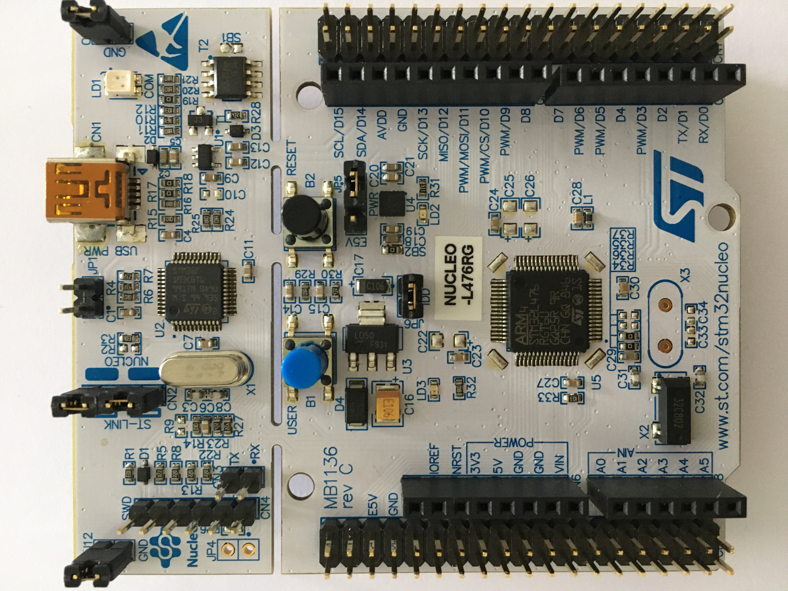
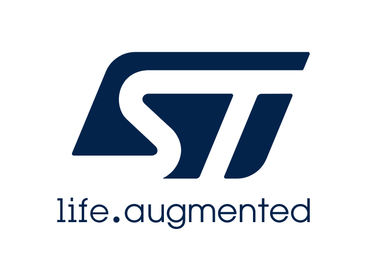

# Stm32xIOT
développement autour d'un microcontrôleur et de l'IOT en générale (Internet Of Things) 

   

   
stm32 from scratch / Atollic / library-st / sensor /

   
Installation
------------
Développement sur stm32 nucleo-L476RG.
Programmation C/CPP sur environnement Atollic TrueStudio.
Depuis et directement de la librairie st.
 

Documentation
-------------

Glossaire
---------

Lien
---------
https://www.st.com/content/st_com/en.html
